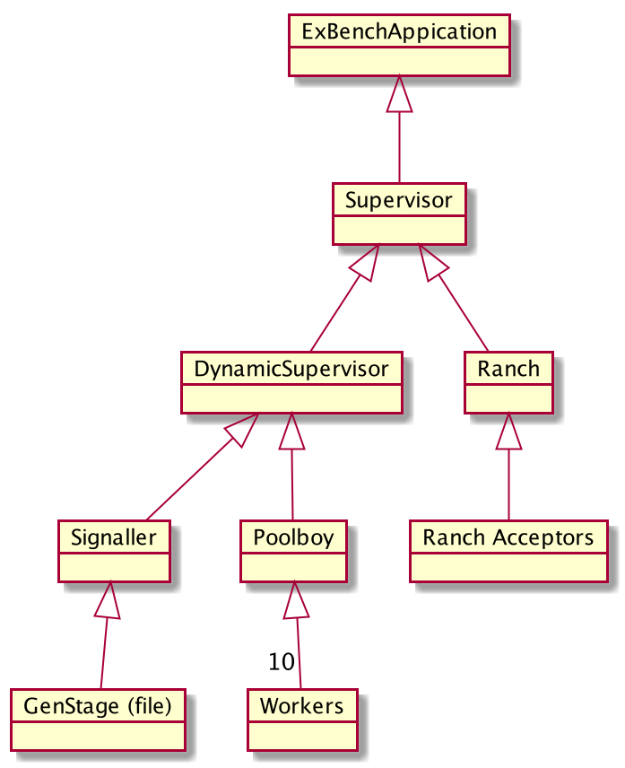

# ExBench

[](https://travis-ci.org/bryanhuntesl/ex_bench) / [Hexdocs](https://hexdocs.pm/ex_bench/)

An application for white box load testing 

## Default configuration (dev running standalone)

[config/dev.exs](config/dev.exs)
```elixir 
config :ex_bench,
  workers: 10,
  overflow: 2,
  concurrency: 3,
  bench_fun: fn x -> IO.inspect(x) end,
  producer: ExBench.FileProducer,
  producer_argument: %{filename: "priv/example.consult"}
```

### Runtime dependencies

* :ex_prometheus

### Startup behavior

The startup behavior of this application depends on whether you embed it as a dependency or run it as a standalone application, for example with `iex -S mix` or `MIX_ENV=prod iex -S mix` or `mix test`.

| Startup type        | Environment | Behavior                                                                                                                                                                                                                |
| ------------------- | ----------- | ----------------------------------------------------------------------------------------------------------------------------------------------------------------------------------------------------------------------- |
| As a dependency     | any         | starts :logger - doesn't run the default task until you execute ExBench.Application.run                                                                                                                                 |
| Standalone          | :dev        | starts application, webserver, prometheus and prometheus export to :4000/metrics - starts running the default task                                                                                                      |
| Standalone          | :prod       | starts application, webserver, prometheus and prometheus export to :4000/metrics - doesn't run the default task until you execute [ExBench.Application.run](https://hexdocs.pm/ex_bench/ExBench.Application.html#run/1) |
| Standalone          | :test       | starts :logger, all scafolding is carried out in the tests/test helper

## Application design / Supervision structure



## Supported Elixir/OTP versions 

See [travis build](https://travis-ci.org/bryanhuntesl/ex_bench) for definitive, up-to-date, test matrix.

|Elixir|  OTP |
|------|------|
| 1.6  | 19   |
| 1.6  | 20.3 |
| 1.6  | 21   |
| 1.7  | 19   |
| 1.7  | 20.3 |
| 1.7  | 21   |
| 1.7  | 22   |
| 1.8.1| 20.3 |
| 1.8.1| 21   |
| 1.8.1| 22   |
| 1.9.0| 20.3 |
| 1.9.0| 21   |
| 1.9.0| 22   |
|------|------|


## Tricks

### Make a bigger input arguments file

```bash
for i in `seq 1 10000` ;  do echo "{test1,{\"$i\", <<7,166>>, #{},[],false, #{<<\"x\">> => <<\"y\">>}}}." ; done >> test/consult.me
```
